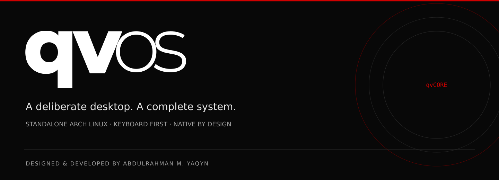
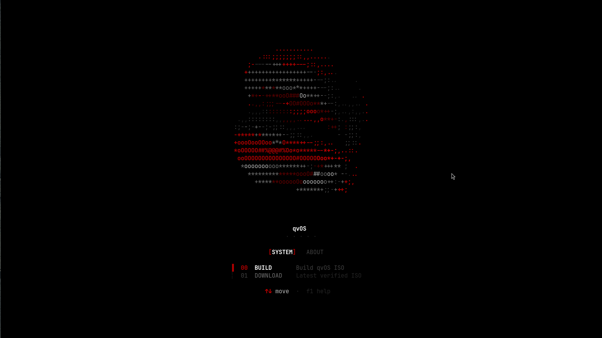

# qvOS

**A standalone Arch Linux distribution by Abdulrahman M. Yaqyn.**

qvOS brings a keyboard-first Wayland desktop, native system tools, and an
integrated installation and maintenance workflow into one product. Its visual
identity pairs deep black and grayscale with a precise red accent. Its
engineering follows the same principle: clear ownership, consistent behavior,
and control that stays with the user.

[Get started](#get-started) · [Features](#features) · [Build & installation](#build--installation) · [Architecture](#architecture) · [Developer](#developer)

## Get started

Open an interactive **Linux x86_64** terminal and run:

```sh
curl -fsSL qvos.yaqyn.dev | sh
```

The public launcher downloads a **compiled terminal interface**, verifies its
SHA-256 checksum and source identity, and opens it in your current terminal.
Opening the interface requires no Go toolchain or existing qvOS installation.
You need `curl`, `tar`, and `sha256sum`; temporary launcher files are removed
when you exit.

| System | About |
| --- | --- |
| **00 BUILD** — create a qvOS installation image | **00 DEVELOPER** — the developer and portfolio |
| **01 DOWNLOAD** — access the confirmed release when available | **01 PROJECT** — the project and its direction |

Use **Tab** or **Left/Right** to switch tabs, **Up/Down** to select an item,
**Enter** to open it, and **F1** for contextual help. The layout adapts to the
terminal; longer information pages wrap and scroll.

**Release status:** the launcher is live. A working-confirmed ISO download is
not available yet, and the Download option reports that status. Running the
command above opens the interface; installation begins separately from bootable
media.



*The live compiled launcher: a red animated core, grayscale typography, and
keyboard navigation. The About tab uses three rings; its information pages use
one ring and readable, left-aligned paragraphs.*

## Features

### A desktop with one identity

qvOS uses **Hyprland** for its Wayland desktop, **Waybar** for system status,
and **Walker with Elephant** for application launching and search. Native
commands connect the desktop's keybindings, menus, window controls, and
application launches.

The bundled **Yaqyn** theme carries the red/grayscale palette across the desktop
and supported applications. Theme management supports compatible user themes,
background selection, and refresh. Font controls provide a consistent
monospace selection, while browser, editor, and terminal defaults can be changed
through qvOS tools.


*The bundled Yaqyn wallpaper. Desktop components and terminal interfaces extend
this restrained visual language with red accents.*

### Native commands and terminal workflows

**`qv` is the product CLI.** Its command catalog provides discoverable help,
examples, aliases, and grouped operations. The shared terminal interface brings
selection, confirmation, authentication, progress, logs, and results into a
consistent workflow.

```bash
qv --help
qv menu
qv menu keybindings
qv theme list
qv font list
qv version
```

The public Build/Download launcher and the installed system share the TUI
engine. Public information pages have their own paragraph layout so they can
remain readable without changing the installed system's presentation.

### Maintenance and recovery

| Capability | What qvOS provides |
| --- | --- |
| Updates | Official qvOS source updates, signed repository package updates, native migrations, and restart or reboot guidance |
| Recovery | Snapper system snapshots and a boot recovery workflow integrated with Limine |
| Configuration | A singular native configuration source, explicit refresh/reset operations, and private recovery backups |
| Packages | Repository package installation and removal, with a separate explicit path for user-selected AUR packages |
| Diagnostics | Bounded local debug information and private logs, without automatic uploads |
| Runtime | Managed desktop services, checked TUI payloads, and controlled restart lifecycles |

Source and package update availability are checked independently, so package
security updates remain visible even when the qvOS source is current. Normal
configuration reconciliation preserves existing user customization; explicit
reset operations provide a deliberate way to restore defaults.

### Everyday tools

| Workflow | Included capabilities |
| --- | --- |
| Capture | Screenshots, region OCR, a clipboard color picker, and screen recording with recovery controls |
| Media | Picture and video conversion, plus terminal-art conversion |
| Sharing | File, folder, and clipboard sharing through LocalSend |
| Files | Thunar integration and native actions for common desktop workflows |
| Personal tools | Private desktop reminders and weather status commands |
| Web Apps | Explicit creation and removal of user-selected Web Apps |
| Sessions | Lock, logout, idle behavior, wake handling, and terminal screensavers |

Capture files and persistent feature state follow private storage boundaries.
Fresh qvOS does not preinstall service-specific Web Apps; users choose the
services they want.

### Hardware, power, and security

qvOS provides monitor scaling and recovery, audio and brightness controls,
hardware detection, battery status, supported charge protection, and Btrfs
hibernation setup. Hardware-specific behavior stays with the feature that owns
it rather than becoming a global workaround.

The installation workflow uses an **encrypted Btrfs system** and the signed
standard Arch kernel. Package signatures remain required. Native login policy
and optional FIDO2 or fingerprint setup complement the session lock and idle
controls. Network tools cover Wi-Fi and DNS configuration, with Cloudflare WARP
available as an explicit option.

Hardware support is validated where it affects installation and boot. T2 Macs
are currently refused by the installer until a verifiably signed provider can
supply their required stack.

### Gaming and optional software

The base includes a gaming runtime; launchers and additional applications are
selected separately. Native installation flows cover **Steam, Heroic, Lutris,
Moonlight, RetroArch, and Minecraft**, with graphics support selected for the
detected hardware where applicable.

Optional desktop software includes supported browsers, terminals, editors,
VPN tools, and a managed **Windows VM** workflow. qvOS keeps installation,
configuration, launch, and removal with the corresponding feature owner.

### Services and Development

The base system remains complete without either optional integration:

| Integration | Scope |
| --- | --- |
| **Services · Proton** | Managed Proton Pass, Drive, Mail Bridge, and VPN tools, with desktop integration and preservation of account data during removal |
| **Development · Devel** | A development workbench with build tools, compilers, debugging and profiling utilities, language tooling, and managed direct tools |

These integrations have independent installation, update, and removal
lifecycles. They are not bundled into the base installation image.

## Build & installation

Select **Build** in the launcher's System tab and confirm to begin. You need:

- **Git** and a running **Docker** daemon accessible to your account.
- At least **40 GiB of free space** on the selected artifact filesystem.
- An Internet connection for source, build tools, and signed package downloads.

The launcher fetches the official `OS` branch, checks that its TUI source
matches the downloaded binary, and delegates to the native qvOS Archiso
builder. Images are written to **`~/qvISO`** by default. Persistent download
caches reduce repeated transfers while retaining integrity and signature checks.

The bootable installer guides the user through **Region → Account → Drive**.
It installs the native system, boot and session configuration, and encrypted
storage. Drive selection and installation are separate from building an image.

A successful build produces a development artifact. A public release must also
pass the complete installation, disk-only boot, update, recovery, and lifecycle
verification for the same pinned candidate. A modified diagnostic VM does not
serve as release proof.

See the [ISO build and release workflow](release/iso/README.md) for the complete
verification requirements, and the [public launcher documentation](release/launcher/README.md)
for packaging and Cloudflare deployment.

## Architecture

**qvCORE is the mandatory implementation of qvOS.** Every native feature owns
its commands, configuration, state, permissions, and lifecycle. Thin adapters
route requests to that owner; optional integrations build on the same core.

| Location | Responsibility |
| --- | --- |
| [`qvcore/`](qvcore/README.md) | Desktop, CLI, configuration, system tools, installation, and maintenance |
| `services/` | Optional service integrations |
| `development/` | Optional development integrations |
| [`release/iso/`](release/iso/README.md) | Native image construction and release verification |
| [`release/launcher/`](release/launcher/README.md) | Compiled public TUI distribution and Cloudflare Worker |
| `test/` | Tests organized around native feature ownership |
| `upstream/` | Read-only upstream review tooling and capability records |
| `compat/` | Bounded external compatibility adapters |

Installed source lives at `~/.local/share/qvos`; checked runtime payloads live
at `~/.local/lib/qvos`. User-editable qvOS configuration belongs under
`~/.config/qvos`, and private persistent state belongs under
`~/.local/state/qvos`.

Explore the [qvCORE architecture](qvcore/README.md) for the full ownership and
lifecycle model.

## Developer

**Abdulrahman M. Yaqyn** develops qvOS across Linux system engineering and
interface design. His work on the project connects the visible desktop with
the less visible systems that make it dependable: native commands,
configuration ownership, installation, updates, and recovery.

qvOS reflects an ongoing focus on coherent experiences and understandable
tools, from a terminal interface's typography to the way a feature is installed,
maintained, and removed. Explore his portfolio and project work at
**[yaqyn.dev](https://yaqyn.dev)**.

## Provenance & license

qvOS is a standalone distribution and owns its product direction, package
selection, native integration, defaults, installer, updates, and releases.
It reviews selected capabilities from [Omarchy](https://github.com/basecamp/omarchy)
through a read-only intake workflow and uses Omarchy's credited signed Stable
package infrastructure. Reviewed upstream capabilities are deliberately ported
into native owners; upstream commits are not merged into the product.

The source is distributed under the [MIT license](LICENSE). Existing copyright
notices are preserved; included packages and third-party components retain
their respective licenses.
