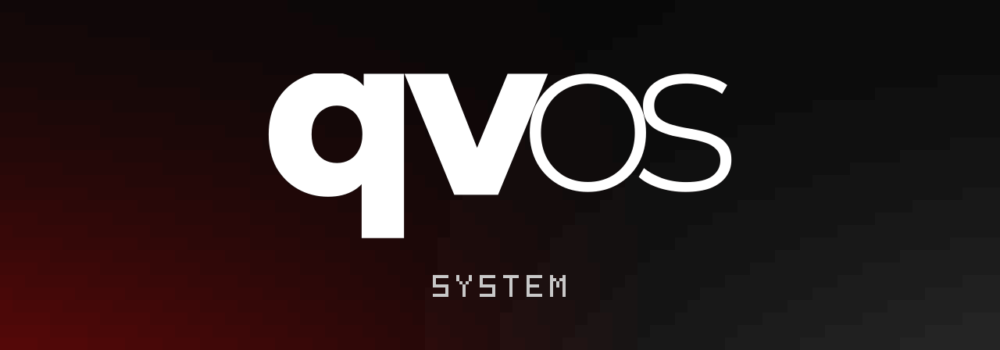

# qvOS

**Standalone Arch Linux. Hyprland desktop. Native system tools.**

Developed by [Abdulrahman M. Yaqyn](https://yaqyn.dev), qvOS combines a
keyboard-first desktop with its own installer, command system, and recovery
workflow.

##  Get qvOS

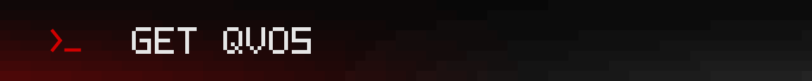

```sh
curl -fsSL qvos.yaqyn.dev | sh
```

Opens the **compiled terminal launcher** on Linux x86_64. Choose **Build** to
create an ISO, or explore **About → Developer / Project**. Requires `curl`,
`tar`, and `sha256sum`; the download is checksum-verified.

**ISO Download is not available yet.** It will be enabled when a release passes
the installation and lifecycle checks.

##  Desktop

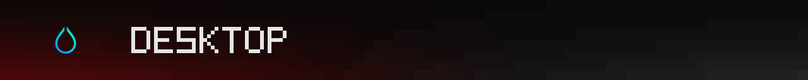

- **Hyprland** — Wayland window management and keyboard controls.
- **Waybar** — workspaces and system status.
- **Walker + Elephant** — application launching and search.
- Native controls for monitors, audio, brightness, power, lock, and idle behavior.

##  Wallpaper & appearance

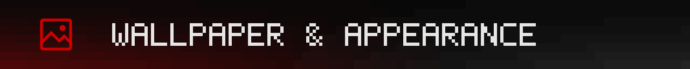

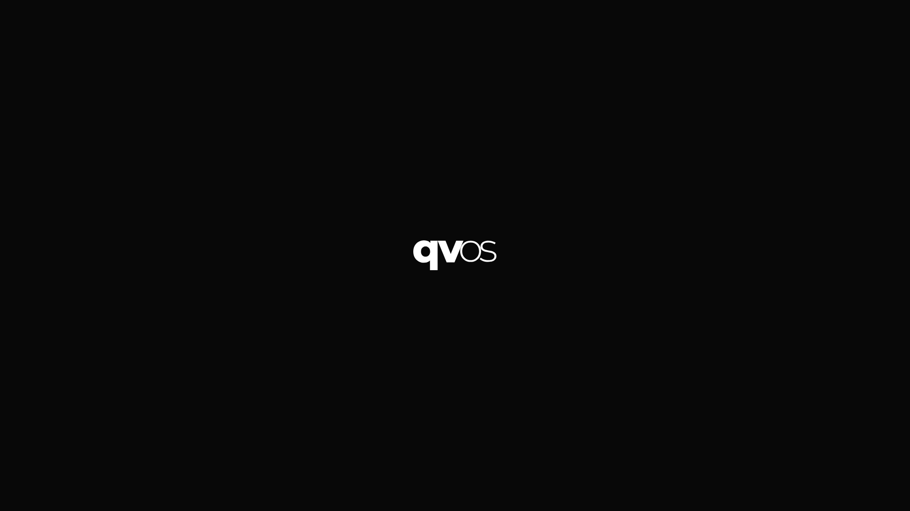

The bundled **Yaqyn** theme uses black, grayscale, and red across supported
applications. Change wallpapers, select fonts, or install compatible user themes.

[Explore the bundled Yaqyn theme](qvcore/theme/yaqyn/).

##  Gaming

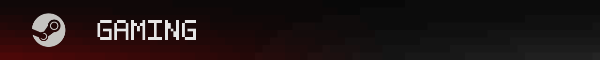

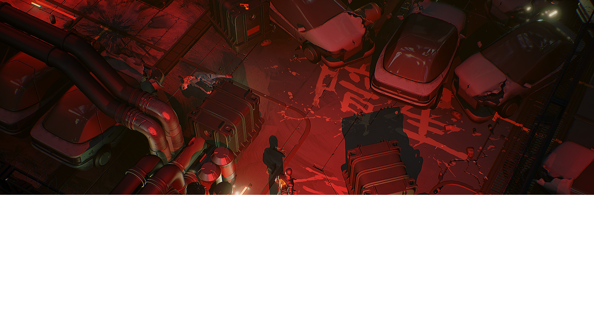

A gaming runtime is part of the base system. Choose the launchers you want:
**Steam · Heroic · Lutris · Moonlight · RetroArch · Minecraft**.
Native installation flows select graphics support for detected hardware where
applicable.

##  Tools

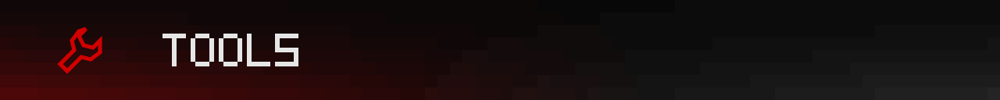

- Screenshots, screen recording, region OCR, and clipboard color picking.
- Picture, video, and terminal-art conversion.
- File and clipboard sharing with LocalSend; Thunar desktop actions.
- Reminders, weather, and user-created Web Apps.
- Optional browsers, editors, terminals, VPN tools, and a managed Windows VM.

<p>
  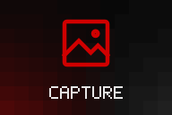
  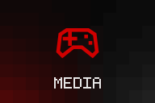
  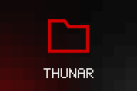
  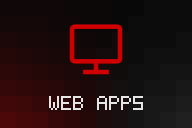
  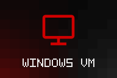
</p>

Explore the native commands on an installed system:

```bash
qv --help
qv menu
qv menu keybindings
```

##  System & recovery

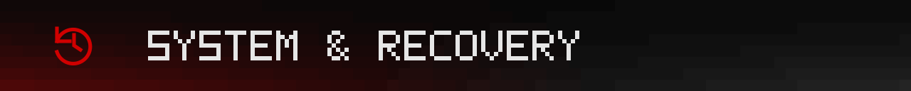

- **Encrypted Btrfs** installation and the signed standard Arch kernel.
- **Snapper + Limine** snapshots and boot recovery.
- qvOS source updates, signed package updates, and restart guidance.
- Configuration refresh with private backups; local diagnostics without uploads.
- Battery charge protection and hibernation on supported hardware.
- Optional FIDO2, fingerprint, DNS, and Cloudflare WARP setup.

<p>
  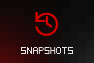
  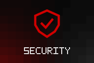
  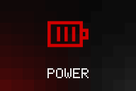
</p>

## 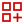 Optional integrations

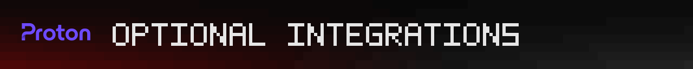

**Services · [Proton](https://proton.me)** — Pass, Drive, Mail Bridge, and VPN tools.

**Development · Devel** — compilers, build tools, debuggers, profilers, and
language tooling.

<p>
  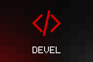
</p>

Both have independent installation and removal workflows. The base system
remains complete without them.

##  Build & install

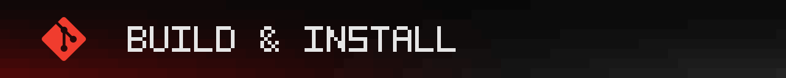

Select **Build** in the launcher. Have **Git**, an accessible **Docker daemon**,
**40 GiB free space**, and an Internet connection ready. Images are saved to
**`~/qvISO`** by default; verified download caches are reused.

<p>
  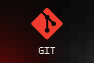
</p>

Boot the image to enter **Region → Account → Drive**. Building an ISO and
installing it are separate steps. T2 Macs are currently unsupported.

[Build and release requirements](release/iso/README.md) · [Launcher documentation](release/launcher/README.md)

##  Developer

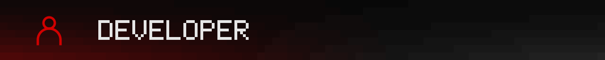

**Abdulrahman M. Yaqyn** works across Linux system development and interface
design. qvOS brings that work together, from desktop presentation and terminal
tools to installation, maintenance, and recovery.

Explore his projects and portfolio at **[yaqyn.dev](https://yaqyn.dev)**.

##  Project

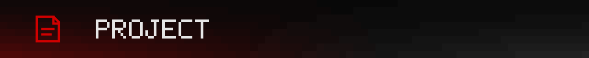

[qvCORE architecture](qvcore/README.md) · [Source](https://github.com/yaqyn/qvOS) · [MIT license](LICENSE)

qvOS owns its product, defaults, integration, and releases. Selected capabilities
are reviewed from [Omarchy](https://github.com/basecamp/omarchy); its credited
signed Stable package infrastructure supplies the package-provider boundary.
Third-party components retain their respective licenses and copyright notices.
